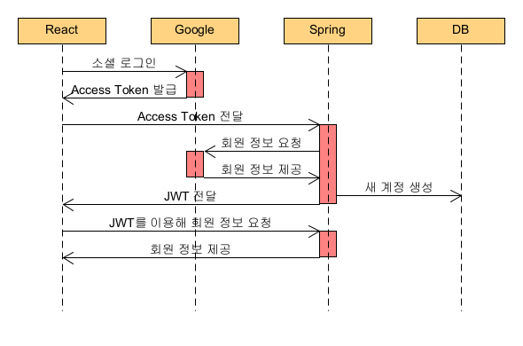

# google-login-oauth2
## ✨HTTP 프로토콜의 특징

### ✔Stateless(무상태)

HTTP 프로토콜은 ***Stateless 프로토콜***이다. 즉, 서버가 클라이이언트의 상태 정보를 저장하지 않는다. 이말은 사용자가 매 요청마다 자신의 정보를 서버에게 알려줘야함을 의미한다. 이 문제를 해결하기 위해서 **세션**과 **JWT**라는 기술을 사용한다.

## ✨기존 Session 방식

### 🔎세션

세션은 **서버의 메모리에 생성되는 공간**으로, 세션에 저장된 정보에는 고유의 **세션ID**가 부여된다.

사용자가 로그인하면 서버는 쿠키에 세션ID를 실어서 브라우저에게 보내준다. 브라우저는 쿠키를 쿠키저장소에 가지고 있다가 서버에 요청을 보낼 때 해당 사용자의 쿠키를 다시 요청 헤더에 포함해서 전송한다. 서버는 세션에서 쿠키 내부의 세션ID와 일치하는 사용자 정보를 가져오고, 매 요청마다 이 작업이 반복되고 로그인이 유지된다.

### ✔ 문제점

세션은 서버의 메모리 내부에 저장된다. 따라서 사용자가 많아지만 그만큼 부담이 커진다.

또한, 서비스의 규모가 커져서 서버를 여러대로 확장 및 분산해야한다면 세션 분리를 따로 고려해야한다.(확장성 문제)

### ✔ Memory, DB

경우에 따라서 세션은 Memory, DB에 저장되기도 한다.

Memory는 DB에 비해 용량이 작고, 또 휘발성이다. 따라서 Memory에 세션을 저장할 경우, 사용자가 많아지면 Memory 공간이 쉽게 부족해질 수 있고, 서버에 문제가 생겨서 꺼지면 로그인된 모든 사용자의 정보가 사라질 수 있다.

위와 같은 문제를 해결하기 위해서는 세션을 DB에 저장할 수 있다. (이 경우 당연히 Memory를 세션 저장소로 사용하는 경우에 비해 속도는 느려진다.) 또는 메모리형 데이터베이스 서버를 사용할 수 있다.

## ✨Session→JWT

### 🔎JWT

JWT(JSON Web Token)은 **인증에 필요한 정보들을 암호화시킨 JSON 토큰**으로, JWT 기반 인증은JWT 토큰(Access Token)을 HTTP 헤더에 실어 서버가 클라이언트를 식별하는 방식이다.

### ✔ 장단점

JWT는 위에서 설명한 세션의 문제점을 해결할 수 있다. 하지만 JWT도 완벽한 해결책은 아니다. 세션처럼 stateful해서 모든 사용자의 상태를 기억하고 있다는 것은 구현하기 부담되고 고려사항도 많지만 기억하는 대상의 상태들을 언제든지 제어할 수 있다는 장점이 있다.(한 기기에만 로그인이 가능한 서비스→PC에서 로그인하면 Mobile에서 로그아웃되게 만듦)

## ✨소셜 로그인

많은 서비스에서 로그인 기능을 가진 id/password 방식보다는 구글, 페이스북, 네이버 로그인과 같은 소셜 로그인 기능을 사용한다. 로그인 기능을 직접 구현하는 경우 다음과 같은 기능들을 모두 구현해야 한다.

- 로그인 보안
- 회원가입 이메일 혹은 전화번호 인증
- 비밀번호 찾기
- 비밀번호 변경
- 회원정보 변경 등

소셜 로그인 사용시 위 기능들을 구글, 페이스북, 네이버 등에 맡기고 서비스 개발에 집중할 수 있는 것이다.

### 🔎OAuth2

OAuth2는 인증을 위한 프로토콜이다. OAuth2를 이용한 로그인 과정은 다음과 같다.

- 구글, 페이스북, 카카오 등에서 제공하는 Authorization Server를 통해 회원정보를 인증하고 **Access Token**을 발급받는다.
- Access Token을 활용해 구글, 페이스북, 카카오 등에서 회원 정보를 가져온다.

## ✨JWT를 이용한 소셜 로그인 구현

---

[Google Oauth2 로그인 프로젝트(React, Spring) (velog.io)](https://velog.io/@heelieben/Google-Oauth2-%EB%A1%9C%EA%B7%B8%EC%9D%B8-%ED%94%84%EB%A1%9C%EC%A0%9D%ED%8A%B8React-Spring)

다음을 참고하여 작성하였습니다.

---



### 🔎React측 구현

**클라이언트 라이브러리 로드**

[Load the client library | Authentication | Google Developers](https://developers.google.com/identity/gsi/web/guides/client-library)

```jsx
<script src="https://accounts.google.com/gsi/client" async defer></script>
```

[Sign In With Google JavaScript API reference | Authentication | Google Developers](https://developers.google.com/identity/gsi/web/reference/js-reference)

**`google.accounts.id.initialize`**메소드를 이용해 로그인 클라이언트 인스턴스를 만들 수 있다. 

```jsx
google.accounts.id.initialize(IdConfiguration)
```

공식문서에 `IdConfiguration`에 들어갈 수 있는 내용이 자세히 나와있다.

```
<script>
  window.onload = function () {
    google.accounts.id.initialize({
      client_id: 'YOUR_GOOGLE_CLIENT_ID',
      callback: handleCredentialResponse
    });
    google.accounts.id.prompt();
  };
</script>
```

**로그인 컴포넌트 만들기**

[Display the Sign In With Google button | Authentication | Google Developers](https://developers.google.com/identity/gsi/web/guides/display-button)

로그인 버튼의 버튼 모양, 크기, 텍스트 및 테마를 맞춤 설정할 수 있다.

### 🔎Spring측 구현

**spring security**

spring security란 애플리케이션의 인증(인증과 권한, 인가 등)을 담당하는 스프링 하위 프레임워크이다. 

✔인증(Authentication)과 인가(Authorization)

-인증: 해당 사용자가 본인이 맞는지를 확인하는 절차→로그인

-인가: 인증된 사용자가 요청한 자원에 접근가능한지 결정하는 절차→로그인 이후

spring security에서는 인증과 인가를 위해 **Principal을 아이디로, Credential을 비밀번호로 사용하는 Credential 기반의 인증 방식**을 사용한다.
